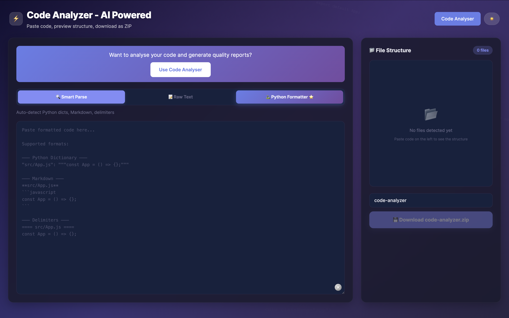

# Code Analyzer - AI-Powered Code Quality Tool



## 🚀 Live Demo

[Deployed on Vercel](https://code-analyzer-five.vercel.app/)

## 📋 Overview

A full-stack code analyzer and ZIP generator with AI-powered insights. Features include JWT authentication, file uploads, code quality scoring, PDF report generation, and a beautiful UI.

## 🛠️ Tech Stack

### Frontend

- React 18.2.0
- React Router DOM 7.1.5
- Tailwind CSS 3.4.1
- Axios 1.5.0

### Backend

- Node.js 20.18.2
- Express 5.2.1
- JWT Authentication
- Multer (File Uploads)
- PDFKit (Report Generation)
- Adm-Zip (ZIP Handling)
- bcryptjs (Password Hashing)

### Deployment

- Vercel 2.0.0

## ✨ Features

### 🔒 Authentication

- User signup/login with JWT tokens
- Protected routes for the dashboard
- Persistent login state

### 📤 Code to ZIP

- 3 modes: Smart Parse, Raw Text, Python Formatter
- File tree preview before download
- Edit content before downloading
- Smart auto-detection of file types and structure

### 📊 Code Analysis

- File upload (supports ZIP and individual files)
- Code quality scoring (0-100)
- Automated suggestions for improvements
- Analysis history

### 📄 PDF Reports

- Professional PDF reports of code analyses
- Downloadable reports
- Summary of scores and suggestions

### 🎨 UI/UX

- Dark/Light mode toggle
- Responsive design
- Smooth animations
- Beautiful gradient styling
- Highlighted Python Formatter as premium mode

## 📁 Project Structure

```
code-analyzer/
├── backend/
│   ├── server.js       # Express server with API endpoints
│   ├── uploads/        # Temporary file storage
│   └── output/         # Temporary ZIP storage
├── public/             # Static files
├── src/
│   ├── context/        # AuthContext
│   ├── pages/          # Login, Signup, Dashboard
│   ├── App.js          # Main app with Code-to-ZIP
│   └── index.js        # Entry point
├── package.json
├── tailwind.config.js
├── postcss.config.js
└── vercel.json
```

## 🛠️ Installation & Setup

### Prerequisites

- Node.js (v20.x)
- npm or yarn

### Local Development

1. Clone the repo: `git clone https://github.com/Zahur13/code-analyzer.git`
2. Install dependencies: `npm install`
3. Create a `.env` file in root:
   ```
   JWT_SECRET=your-secret-key
   PORT=5001
   ```
4. Start the backend: `npm run server`
5. In a new terminal, start the frontend: `npm run dev`
6. Open [http://localhost:3000](http://localhost:3000)

### Build for Production

```bash
npm run build
```

## 🎯 Key Highlights for Recruiters

### 🔨 Full-Stack Development

- Built a complete full-stack application from scratch
- Implemented both frontend and backend
- Deployed to production on Vercel

### 🔐 Security

- JWT-based authentication
- Password hashing with bcryptjs
- Protected API routes

### 📝 Clean Code & Architecture

- Organized project structure
- React Context for state management
- Clean API endpoints
- Responsive design

### 🚀 Performance & Optimization

- Production-ready build configuration
- Optimized for Vercel deployment
- File upload handling

### 🎨 Design Skills

- Beautiful, modern UI
- Dark/Light mode
- Gradient styling
- Smooth animations

## 🔮 Future Improvements

- Integrate a real AI API (Hugging Face, OpenAI)
- Add a database (MongoDB, PostgreSQL) instead of in-memory storage
- More code quality rules
- User profile management
- GitHub integration

## 📧 Contact

- GitHub: [Zahur13](https://github.com/Zahur13)
- LinkedIn: [Jahurhusen Shaikh](https://www.linkedin.com/in/jahurhusen-shaikh-a309361b9/)

---

Thank you for checking out this project! Feel free to reach out with any questions or feedback!
